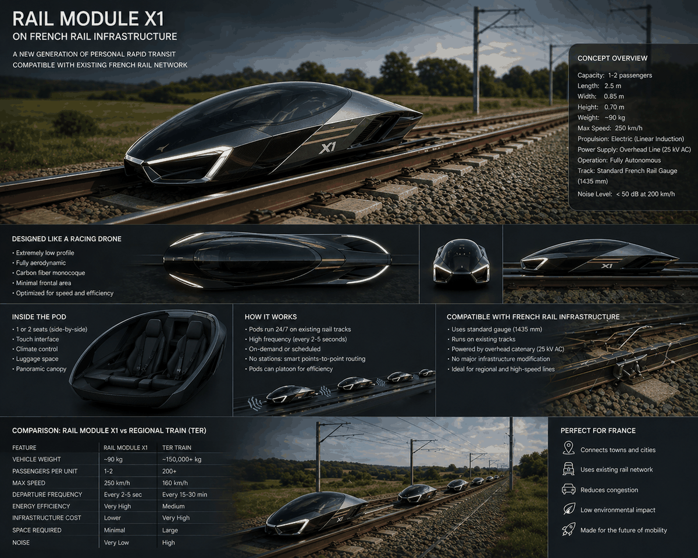
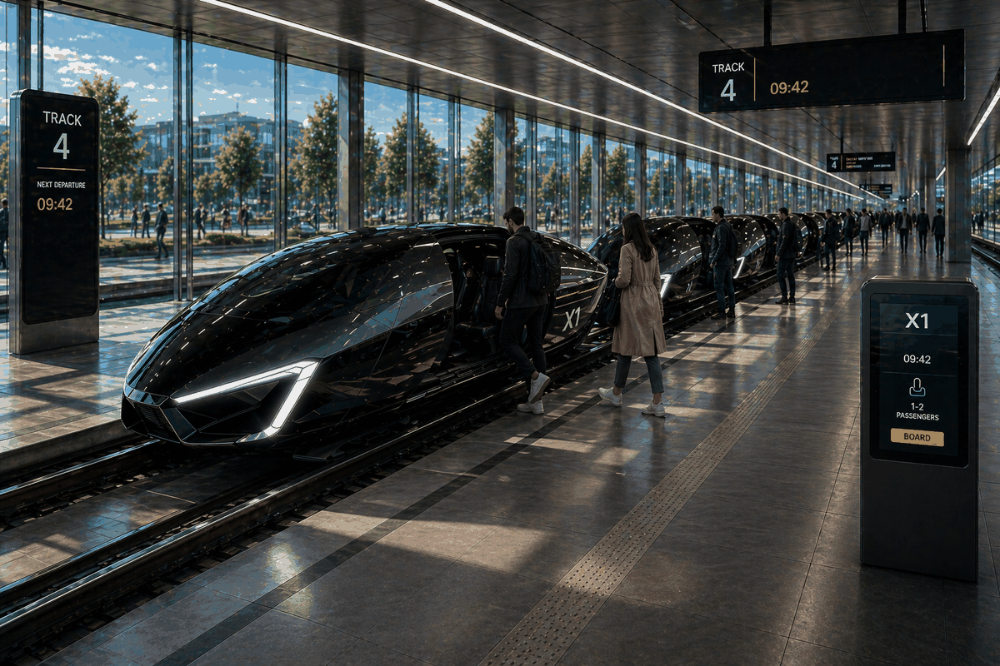

# ACKRail

ACKRail is a research and simulation project for a new form of autonomous, high-speed, on-demand rail mobility.

The core idea is to remove as much asphalt, road traffic, and private road vehicles as possible from a territory, then replace them with compact rail modules, shared infrastructure, and more natural ground surfaces. Instead of designing a city around cars, the project studies how a city could be designed around fast, quiet, automated rail pods that provide direct door-to-door or near-door-to-door mobility.

  

## Vision

The long-term objective is to explore a transport system that is:

- **Autonomous**: modules circulate without human driving and are managed by a central optimization system.
- **High frequency**: small modules can depart continuously instead of waiting for fixed train schedules.
- **High speed**: rail guidance allows faster, safer, and more energy-efficient movement than road vehicles.
- **Low footprint**: infrastructure should use less surface area than roads and parking lots.
- **Territory-friendly**: land currently used for asphalt, road lanes, and vehicle storage can be returned to vegetation, public space, housing, agriculture, or water management.
- **Modular**: the first simulations focus on biplace passenger modules, but the same system could later support cargo, service, animal transport, emergency, or larger passenger modules.

## Concept Images

The images in this repository are concept references only. They communicate the intended direction of the system, but their technical characteristics are not fixed requirements.

- `asset/modules/biplace.png`: first passenger module used for the initial simulations.
- `asset/modules/van.png`, `asset/modules/7t.png`, `asset/modules/35t.png`, `asset/modules/animals.png`: possible future module families.
- `asset/more/station.png`: station and boarding concept.
- `asset/more/immersion.png`: passenger experience concept.

  

## First Research Goal: A 10 km x 10 km Algorithmic City

The first study area is a square city of **10 km by 10 km**. The objective is to determine how a rail-module network could provide the best possible mobility service inside that city while minimizing infrastructure and operating cost.

The first simulation should use only **biplace passenger modules**.

### Optimization Objectives

The simulation should search for network designs and operating strategies that minimize:

- **Average door-to-door travel time** between any two places in the city.
- **Worst-case door-to-door travel time**, for example from one corner of the city to the opposite corner.
- **Infrastructure cost**, including rail length, junctions, stations, parking areas, maintenance areas, and energy systems.
- **Operating cost**, including fleet size, empty repositioning, waiting time, energy use, and peak capacity requirements.

The goal is not only to draw a rail map. The goal is to evaluate the complete mobility system: infrastructure, modules, stations, dispatching, traffic control, parking, and passenger experience.

## Simulation Scenarios

The system should be tested under several demand conditions.

### Normal Operation

- **Off-peak hours**: lower demand, more relaxed routing, lower fleet utilization.
- **Peak hours**: commuting demand, concentrated flows, higher boarding pressure, tighter headways.

### Event Operation

The simulation should also include special events such as a stadium match, concert, festival, or large public gathering.

These scenarios create temporary, highly directional flows. The study should measure how the system handles:

- Pre-event arrival waves.
- Post-event departure surges.
- Temporary station saturation.
- Module staging before the event ends.
- Priority routing and crowd-safe boarding.

## System Questions To Study

The simulation should help answer practical design questions such as:

- What rail topology works best for a 10 km x 10 km city: grid, rings, diagonals, hierarchy, or hybrid network?
- How dense should stations or boarding points be?
- How many modules are required for peak and off-peak operation?
- How much parking or staging space is needed for idle modules?
- Where should depots, maintenance areas, and energy infrastructure be placed?
- How should the system manage merges, crossings, overtaking, and high-speed separation?
- Can suction, aerodynamic effects, platooning, or enclosed corridors improve performance?
- What level of redundancy is required if one track segment, station, or junction fails?

## Operating System

The project assumes a fully automated rail management system responsible for:

- Real-time demand prediction.
- Passenger assignment.
- Module dispatching.
- Empty-module repositioning.
- Station boarding and alighting management.
- Traffic control at junctions.
- Overtaking and priority management.
- Module parking and storage.
- Incident recovery.
- Energy-aware routing and scheduling.

The simulation should make these decisions explicit so that different strategies can be compared.

## Second Research Goal: Connecting Territories

After studying one algorithmic square city, the next goal is to connect multiple territories together.

This includes:

- Linking several 10 km x 10 km rail-module cities.
- Connecting new planned areas to existing towns.
- Serving legacy urban zones that were not designed around the system.
- Serving countryside zones with lower density and longer distances.
- Connecting to existing regional or national rail infrastructure when relevant.

The objective is to minimize both **infrastructure cost** and **operating cost** while preserving high-quality service.

## Expected Outputs

This project should progressively produce:

- A demand model for a 10 km x 10 km city.
- Several candidate rail-network layouts.
- A simulator for biplace module circulation.
- Metrics for average travel time, worst-case travel time, waiting time, fleet utilization, energy use, and cost.
- Peak, off-peak, and event-day comparisons.
- Visualizations of module movement, station load, congestion, and unused capacity.
- Recommendations for infrastructure density, fleet size, station design, and operating rules.

## Design Freedom

The system is intentionally open for exploration. Any architecture is acceptable if it supports the main ambition:

> Design an autonomous, high-speed rail-module management system that can replace most road-vehicle mobility while reducing asphalt, infrastructure footprint, and territorial damage.

